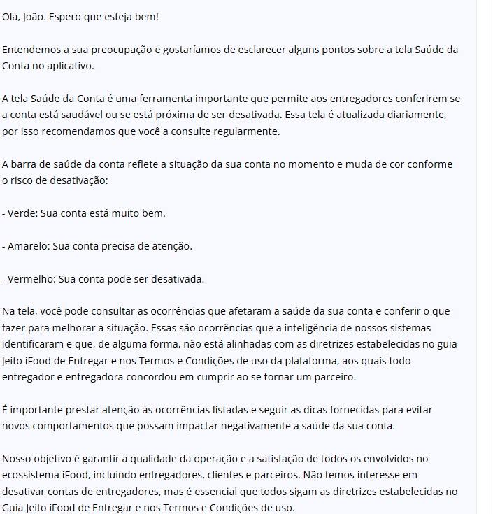

<!DOCTYPE html>
<html lang="en">
<head>
    <meta charset="UTF-8">
    <meta name="viewport" content="width=device-width, initial-scale=1.0">
    <title>Projeto Registrador de Usuarios!!!</title>
</head>
<body>
    <h1>Projeto Registrador de Usuarios Simples</h1>
    
Projeto Criado Para um trabalho da faculdade Da Disciplina ESTRUTURA DE DADOS

    <h2>
        Imagens do projeto:
    </h2>
    <picture>
        
    </picture>
</body>
</html>
